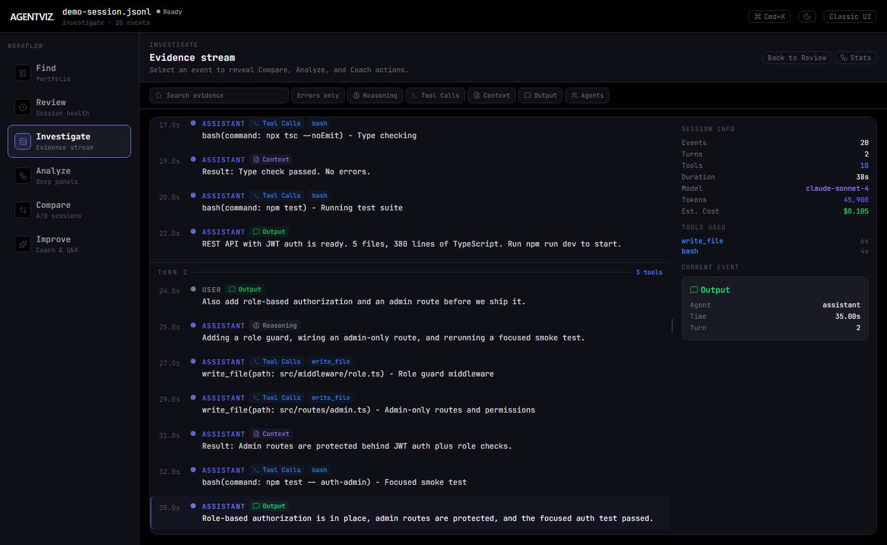
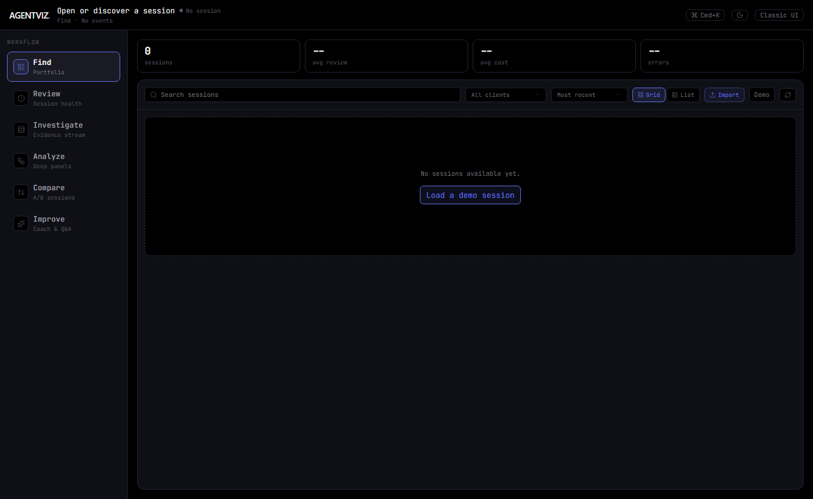
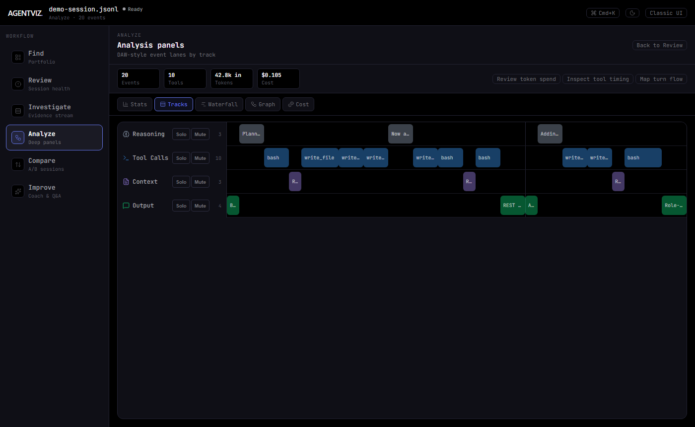
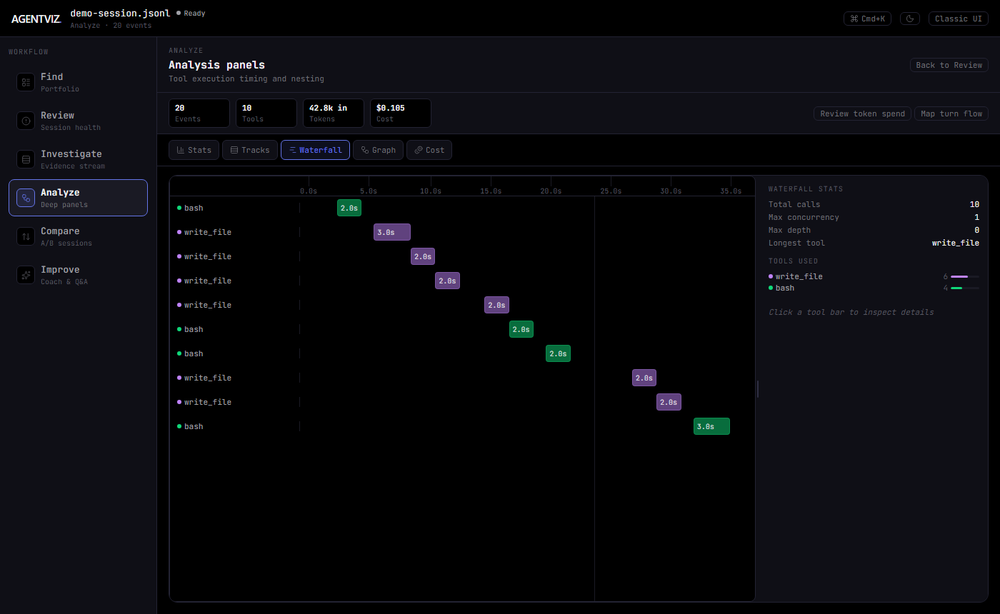
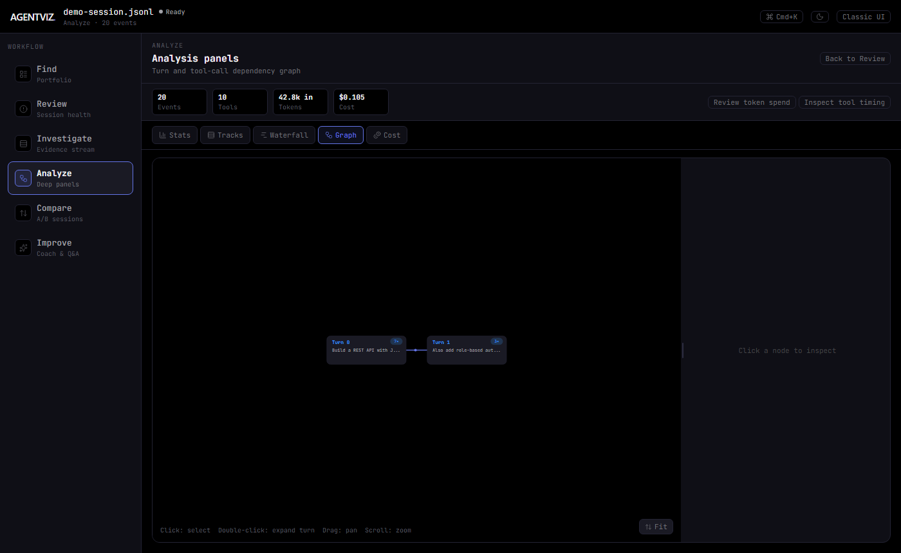
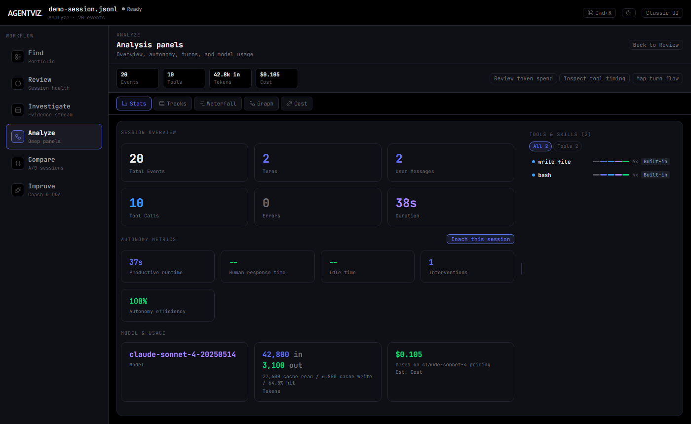
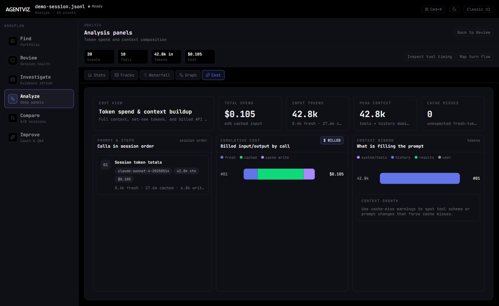
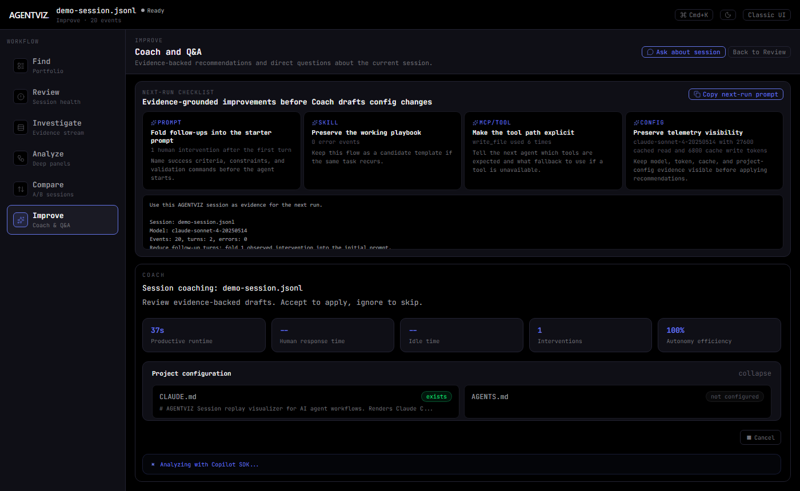

<div align="center">

# ◇ AGENTVIZ

**See what your AI agents actually do.**

Drop a Claude Code, Codex, VS Code Copilot Chat, Copilot CLI, Copilot prompt export, or ATIF / Harbor session file and review the run as a workflow: find the session, triage health, investigate evidence, analyze behavior, compare approaches, and improve the next prompt or configuration. Or run it from the CLI for a live view that updates as your session unfolds.

[](https://github.com/jayparikh/agentviz/actions/workflows/ci.yml)
[](https://www.npmjs.com/package/agentviz)


<br />



*Start in Review, then move through Investigate, Analyze, Compare, and Improve to inspect the same session from every angle.*

</div>

---

## Why AGENTVIZ?

AI coding agents (Claude Code, Codex, VS Code Copilot Chat, Copilot CLI, ATIF / Harbor, etc.) generate dense session logs, but reading raw JSONL is painful. AGENTVIZ turns those logs into something you can actually explore. Copilot CLI replays also surface the effective reasoning effort and any mid-session changes:

- **Replay** sessions like a video, stepping through each tool call and reasoning step
- **Trace** decision flow in a graph view with expandable turn and tool-call structure
- **Visualize** timing and concurrency in tracks and waterfall timelines
- **Analyze** tool usage patterns, error rates, and model behavior at a glance
- **Inspect cost** with per-call token spend, cache reads/writes, context composition, and cache-miss warnings
- **Debug** failures by jumping directly between errors with one keystroke
- **Stream live** as a session unfolds -- the view updates in real time
- **Discover sessions** automatically from Claude Code, Codex, Copilot CLI, and VS Code Copilot Chat stores
- **Get AI coaching** on prompt engineering, skills, and MCP setup grounded in best practices
- **Switch themes** between dark, light, and system-matched modes with one click
- **Use the default workflow UI**: Find, Review, Investigate, Analyze, Compare, Improve, with Classic UI available as a fallback

## Quick Start

```bash
npx agentviz
```

Opens AGENTVIZ in your browser. The default workflow UI starts in **Find**, where you can drop a `.jsonl` or `.json` session file or click **Load a demo session** to try it instantly. Claude Code, Codex, Copilot CLI, and VS Code Copilot Chat sessions are auto-discovered.

### CLI (live streaming)

```bash
npx agentviz ~/.claude/projects/my-project/session.jsonl

# Or pass a directory -- opens the most recently modified .jsonl inside it
npx agentviz ~/.claude/projects/my-project/
```

The browser opens with a pulsing **LIVE** badge. As Claude Code writes new events to the session file, they stream into the view in real time via SSE, including records that are written incrementally before the trailing newline lands.

### CLI (self-contained manifest export)

Generate a single HTML file from a static manifest and its local session files:

```bash
npx agentviz export --manifest ./data/manifest.json --out ./agentviz-report.html
```

The output embeds the AGENTVIZ app, the manifest, and all referenced JSONL sessions. It can be opened directly from disk without running a local web server. Manifest session URLs must be local paths relative to the manifest file; remote URLs are rejected because they cannot be embedded.

### Finding your session files

```bash
# Claude Code sessions
ls ~/.claude/projects/

# Copilot CLI sessions
ls ~/.copilot/session-state/
# Each subdirectory is a session UUID containing an events.jsonl file

# Codex sessions
ls ~/.codex/sessions/
# Rollout logs live under YYYY/MM/DD/rollout-*.jsonl
```

VS Code Copilot Chat sessions live under your VS Code `workspaceStorage/*/chatSessions/` directories. The exact parent path depends on your OS and whether you use the stable or Insiders build.

## MCP Integration

AGENTVIZ ships as an MCP server so you can open it directly from Claude Code or GitHub Copilot in VS Code without leaving your workflow. Both agents use the same `launch_agentviz` and `close_agentviz` tools.

### Claude Code

**Setup (one time):**

```bash
claude mcp add --scope user agentviz node /path/to/agentviz/mcp/server.js
```

This registers the server globally across all projects. Restart Claude Code to pick it up.

**Usage:** In any session, just ask:

> "Open agentviz" or "Show me the live view"

### GitHub Copilot in VS Code

**Setup:** Add the server to your VS Code user settings (`settings.json`) for global access across all projects:

```json
{
  "mcp": {
    "servers": {
      "agentviz": {
        "type": "stdio",
        "command": "node",
        "args": ["/path/to/agentviz/mcp/server.js"]
      }
    }
  }
}
```

Or scope it to a single project by creating `.vscode/mcp.json` in your workspace:

```json
{
  "servers": {
    "agentviz": {
      "type": "stdio",
      "command": "node",
      "args": ["/path/to/agentviz/mcp/server.js"]
    }
  }
}
```

Reload VS Code after adding the config. In Copilot Chat, use **Agent mode** and ask:

> "Open agentviz" or "Launch the live view"

### What happens when you invoke it

`launch_agentviz` will:

1. Auto-detect the most recently active session file from Claude Code, Codex, Copilot CLI, or VS Code Copilot Chat storage
2. Start a local HTTP server on a free port
3. Open the browser with live streaming enabled

To stop it, ask: "Close agentviz"

### Available MCP tools

| Tool | Description |
|------|-------------|
| `launch_agentviz` | Start the server and open the browser. Accepts an optional `session_file` path. |
| `close_agentviz` | Stop a running server. Accepts an optional `port`; omit to stop all. |

## Inbox and AI Coach

When running via the CLI, AGENTVIZ automatically discovers recent Claude Code, Codex, Copilot CLI, and VS Code Copilot Chat sessions and shows them on the landing screen in two interchangeable modes: a row-based inbox sorted by review priority and a dashboard card grid with aggregate stats, filters, refresh, and the same one-click open flow.

Each loaded session can get an AI Coach analysis powered by the `@github/copilot-sdk` (gpt-4o). The coach reads your actual project config (`.github/copilot-instructions.md`, skills, MCP servers) and produces actionable recommendations for prompts, skills, and tooling setup. Recommendations can be applied directly with one click.

## Default workflow UI

AGENTVIZ now defaults to the task-oriented workflow shell. The same parser and session model power both the default workflow UI and the Classic UI fallback:

| Zone | Purpose |
|------|---------|
| Find | Unified session portfolio with search, filters, layout toggle, tags, import, demo, refresh, and multi-select compare |
| Review | Health score, summary cards, top tools, and evidence-linked insights |
| Investigate | Replay evidence stream with contextual Analyze, Compare, Ask, and Coach actions |
| Analyze | Existing Stats, Tracks, Waterfall, Graph, and Cost views as sub-panels |
| Compare | Inline comparison using the existing scorecard and tools chart |
| Improve | Coach recommendations, next-run checklist, and Session Q&A |

The redesign changes the top-level model from visualization tabs to user jobs. Instead of choosing between Replay, Tracks, Waterfall, Graph, Stats, Cost, and Coach up front, you start with a health-oriented Review, follow evidence in Investigate, open deeper Analyze panels only when needed, and turn the run into next-run improvements from Improve.

If you know the Classic UI, the old surfaces still exist:

| Classic UI surface | Default workflow home |
|--------------------|-----------------------|
| Replay | Investigate |
| Tracks | Analyze -> Tracks |
| Waterfall | Analyze -> Waterfall |
| Graph | Analyze -> Graph |
| Stats | Analyze -> Stats |
| Cost | Analyze -> Cost |
| Coach | Improve |
| Compare | Compare, or Find multi-select |

The workflow shell is mounted exclusively by default (`agentviz:v2:enabled`). Click **Classic UI** in the header to use the original replay-first interface, or **Default UI** in Classic UI to return to the workflow shell. Classic UI is a fallback, not a separate parser or data path.

## Session Comparison

Load two agent traces side by side to compare them head to head. Great for benchmarking Claude Code vs Copilot CLI on the same task, or comparing two different prompting strategies.

### Entry points

- **Landing screen** -- click **Compare two sessions** below the drop zone
- **Single-session header** -- click **Compare** while viewing any session to add a second trace for comparison
- **Find zone** -- select two sessions and click **Compare selected**
- **Compare landing** -- drop Session A and Session B independently; the view opens once both are loaded

### Scorecard tab

Side-by-side metrics with delta badges:

| Metric | Delta color |
|--------|-------------|
| Duration | Green = A faster |
| Cost / Credits | Green = A cheaper when units match (delta suppressed for cross-agent comparisons since units differ) |
| Input / Output tokens | Neutral |
| Cache reads / writes | Neutral (shown only when cache data present) |
| Cache hit rate | Neutral (shown only when cache data present) |
| Tool calls | Neutral |
| Errors | Green = A has fewer |
| Turns | Neutral |
| Files touched | Neutral |

### Tools tab

Horizontal bar chart showing tool call counts for both sessions on the same axis. Blue bars = Session A, purple bars = Session B.

### Export

Click **Export** in the default workflow header, Classic UI header, or comparison header to download a single self-contained `.html` file. Share it with anyone -- no server required. Opening it reproduces the full session or comparison view exactly as you see it.

Export is available in two places:

- **Single session header** -- exports the current session from either the default workflow UI or Classic UI
- **Comparison header** -- exports both sessions and the full comparison view

> Export requires the production build (`npm run build`). It is not available in the Vite dev server.

---

## Features

### Find and Review

The default entry point is a session portfolio for import, demo loading, auto-discovered sessions, filters, tags, and multi-select compare. Opening a session lands in Review with health scoring, evidence-linked insights, top tools, and data-readiness checks.

<div align="center">

</div>

### Investigate

Investigate wraps the chronological replay stream with search, error-only mode, track filters, contextual Analyze/Compare/Improve actions, and a resizable inspector sidebar. Click any event to see full details plus a payload inspector with readable JSON or text, top-level keys, line and character counts, copy support, and expand or collapse controls.

<div align="center">

</div>

### Analyze: Tracks

DAW-style multi-track lanes for Reasoning, Tool Calls, Context, and Output. **Solo** isolates one track. **Mute** hides it. See at a glance how your agent's time was spent.

<div align="center">

</div>

### Analyze: Waterfall

Gantt-style timeline of every tool call, sorted by start time with nesting for overlapping calls. Hover any bar to see duration and timing. Click to open the full inspector, including inline diffs for file edits and readable input or result payload previews.

<div align="center">

</div>

### Analyze: Graph

Interactive directed graph of session turns with expandable tool-call structure. When a turn spawns parallel subagents, the graph automatically forks into side-by-side agent branches and rejoins at a diamond join node, visualizing concurrency without any interaction. Double-click any turn to open its internal tool flow, pan and zoom around the graph, and follow playback as active nodes light up and future nodes fade back.

<div align="center">

</div>

### Analyze: Stats

Aggregate metrics, event distribution bars, tools used ranking, and a per-turn summary. Includes token counts, estimated USD cost per turn for Claude models, and per-turn cache hit rate summaries when prompt caching data is available. The cache write segment is omitted when it is zero.

A **Tools &amp; Skills** panel surfaces every skill, instruction file, custom agent, MCP server, built-in tool, and prompt that appeared in the session. Each entry shows its lifecycle stage (Discovered &rarr; Loaded &rarr; Invoked &rarr; Resources &rarr; Completed or Errored) as a mini progress bar, its invocation count, and its source (project / personal / extension / built-in / MCP). Click any row to expand its full event timeline. Filter by category (Skills, Instructions, Agents, Tools, MCP, Prompts) or click a source chip to isolate entries from that origin.

<div align="center">

</div>

### Analyze: Cost

Per-call token spend, cache read/write usage, context composition, and cumulative cost for sessions with token usage. Copilot CLI sessions report usage-based AI Credits, shown with the USD equivalent (1 credit = $0.01); token-based USD estimates are used as a fallback for older logs when pricing is recognized. Copilot prompt exports include prompt context breakdowns so the view can highlight fresh input spikes, cache misses, tool schema growth, and which parts of the prompt are filling the context window.

<div align="center">

</div>

### Improve

AI-powered session coaching available directly from any session. Improve combines Coach recommendations, a copyable next-run prompt, prompt/skill/MCP-tool/config checklist items, and Session Q&A. The coach reads your autonomy metrics, project config (`.github/copilot-instructions.md`, MCP servers, skills), and session patterns to produce evidence-backed recommendations for prompts, tooling, and workflow. Click **Analyze** to run, then accept or ignore each draft recommendation. Requires the CLI server -- run via `npx agentviz`, `npm start`, or the MCP tool.

<div align="center">

</div>

### More Features

| Feature | Description |
|---------|-------------|
| **Live Streaming** | CLI mode tails a session file via SSE. View updates in real time as events arrive, including newline-delayed JSONL writes from Claude Code. |
| **Payload Inspector** | Replay and waterfall inspectors show readable JSON or text previews with key summaries, counts, copy, and expand controls. |
| **Graph View** | Directed turn-flow graph with fork/join DAG for parallel subagents, expandable tool-call nodes, pan/zoom, and playback-aware highlighting. |
| **Token and Cost Tracking** | Per-turn and per-call token usage with estimated USD cost for Claude and OpenAI/Copilot models, plus reported AI Credits (with USD equivalent) for Copilot CLI logs. |
| **Search** | Full-text search across events, tools, and agents. Matches highlighted in real time. |
| **Command Palette** | `Cmd+K` fuzzy search to jump to any turn, event, or view instantly. |
| **Workflow Command Palette** | In the default UI, `Cmd+K` searches workflow zones and flow-aware commands such as failed tool calls, cost analysis, compare, and Q&A. |
| **Error Navigation** | Auto-detects errors from flags and text patterns. Jump with `E` / `Shift+E`. |
| **Track Filters** | Toggle visibility per track type with filter chips in the header. |
| **Playback Control** | Play/pause with variable speed (0.5x to 8x). Seek with arrow keys. |
| **Diff Viewer** | Inline unified diff with dual-gutter line numbers for file-editing tool calls. |
| **Auto-detect Format** | Supports Claude Code JSONL, Codex rollout JSONL, Copilot CLI JSONL, VS Code Copilot Chat JSON or JSONL, Copilot prompt export JSON, and ATIF / Harbor trajectory JSON. Auto-detected. |
| **Session Comparison** | Load two traces side by side. Scorecard and tool-usage chart with delta badges. |
| **HTML Export** | One-click export of any session or comparison to a self-contained shareable `.html` file. |
| **Inbox Auto-discovery** | Automatically finds recent Claude Code, Codex, Copilot CLI, and VS Code Copilot Chat sessions and ranks them by review priority. |
| **Inbox Refresh** | Rescan session directories with a one-click refresh button. Reconciles evicted content and prunes dead entries. |
| **File Path Tooltips** | Hover over inbox or Find session rows to see the full file path or reconstructed session location. Opened sessions loaded from discovery or CLI expose a header path control for copying the source path. |
| **Static Manifest Mode** | Deploy as a pure static site with `?manifest=URL` pointing to a JSON manifest of sessions. Tag-based filtering, no backend required. |
| **AI Coach** | Agentic analysis powered by Copilot SDK. Recommends prompts, skills, and MCP config with one-click apply. |
| **Session Q&A** | Slide-over drawer (`Cmd+Shift+K` in Classic UI, Improve in the default UI) with instant answers for common queries and Copilot SDK model fallback for open-ended questions. |
| **Skills and Capability Tracking** | Stats View surfaces every skill, instruction, agent, MCP server, tool, and prompt from the session with lifecycle stage bars, invocation counts, source chips, and expandable event timelines. Filter by category or source. |
| **Autonomy Metrics** | Measures human response time, idle gaps, and intervention frequency per session. |
| **Dark / Light / System Theme** | Full dark and light palettes with a one-click switcher in the header. System mode auto-follows OS preference. Preference is persisted across sessions. |

### Session Q&A

Open the drawer with `Cmd+Shift+K` (or via the command palette). Questions are routed through a two-tier system:

1. **Instant answers** -- a local classifier matches 9 common patterns and responds immediately from session data, with no API call:

   | Pattern | Example question |
   |---------|-----------------|
   | Tool count | "how many tool calls?" |
   | Errors | "were there any errors?" |
   | Duration | "how long did this take?" |
   | Models | "what model was used?" |
   | Turns | "how many turns?" |
   | Longest tool | "which tool took the longest?" |
   | Cost | "how much did this cost?" |
   | File edits | "what files were edited?" |
   | Summary | "summarize this session" |

2. **Model fallback** -- anything the classifier can't match is sent to the Copilot SDK (configurable model, see [Configuration](#configuration)) with full session context for an AI-generated answer.

> **Classic UI note:** The Classic UI drawer is still controlled by the `qa` feature flag. The default workflow UI exposes Q&A directly in Improve.

## Keyboard Shortcuts

| Key | Action |
|-----|--------|
| `Space` | Play / Pause |
| `Left` / `Right` | Seek 2 seconds |
| `1` / `2` / `3` / `4` / `5` / `6` / `7` | Switch view (Replay / Tracks / Waterfall / Graph / Stats / Cost / Coach) |
| `/` | Focus search |
| `E` / `Shift+E` | Next / Previous error |
| `Cmd+K` | Command palette |
| `Cmd+Shift+K` | Toggle Session Q&A drawer |
| `Enter` / `Shift+Enter` | Next / Previous search match |
| `?` | Toggle keyboard shortcuts dialog |

In the default workflow UI, number keys map to workflow zones: `1` Find, `2` Review, `3` Investigate, `4` Analyze, `5` Compare, and `6` Improve. Pressing the old Coach shortcut `7` opens Improve and shows a migration notice.

Modals, drawers, and overlay panels render keyboard hints with a shared `<kbd>` badge treatment so close, navigate, and select affordances read consistently across AGENTVIZ.

## Supported Formats

| Format | File type | Auto-detected by |
|--------|-----------|-----------------|
| Claude Code | `.jsonl` from `~/.claude/projects/` | Default fallback |
| Codex | `.jsonl` rollout logs from `~/.codex/sessions/YYYY/MM/DD/` | `session_meta` with Codex origin metadata |
| VS Code Copilot Chat | `.json` or `.jsonl` from VS Code `workspaceStorage/*/chatSessions/` | `version` + `requests` + `sessionId` fields |
| Copilot CLI | `.jsonl` event traces | `session.start` with `producer: "copilot-agent"` |
| Copilot prompt export | `.json` prompt export arrays or wrappers | Prompt calls with `request.messages` and `response.usage` |
| ATIF / Harbor | `.json` trajectory from the Harbor framework | Top-level `schema_version: "ATIF-v1.6"` with `agent` and `steps` |

Codex sessions are discovered from rollout logs only. AGENTVIZ intentionally ignores `~/.codex/history.jsonl`, sqlite logs, auth/config files, caches, shell snapshots, and plugin temp data.

ATIF (Agent Trajectory Interchange Format) sessions are loaded via drag-and-drop, a positional CLI path, or `?manifest=` URLs. Auto-discovery is not wired up because Harbor has no canonical output directory.

More formats planned -- see [Roadmap](#roadmap).

## Static Manifest Mode

Deploy AGENTVIZ as a pure static site with pre-populated sessions -- no backend required. Pass a `?manifest=` query parameter pointing to a JSON manifest:

```
https://example.com/replay/?manifest=sessions/manifest.json
https://example.com/replay/?manifest=https://cdn.example.com/data/manifest.json
https://example.com/replay/?manifest=sessions/manifest.json&tag=nightly&tag=dotnet
```

The manifest lists sessions with display names, relative URLs, and freeform tags:

```json
{
  "generated": "2026-03-31T00:00:00Z",
  "sessions": [
    {
      "id": "build-analysis-1",
      "name": "MSBuild: Build + binlog (skilled)",
      "url": "skilled-build.jsonl",
      "tags": ["dotnet-msbuild", "build-failure-analysis", "skilled"],
      "mtime": 1743400000000
    }
  ]
}
```

Session URLs are resolved relative to the manifest location. Tags appear as filter chips in the inbox (AND logic). Pre-apply filters with `&tag=X` query params.

To package a static manifest deployment as one shareable file instead of hosting the manifest and JSONL files, run:

```bash
npx agentviz export --manifest ./data/manifest.json --out ./agentviz-report.html
```

## Architecture

```
src/
  App.jsx                # Default v2 mount + Classic UI fallback, theme wiring, session entry routing
  AppV2.jsx              # Default workflow shell: Find, Review, Investigate, Analyze, Compare, Improve
  main.jsx               # React entry point
  contexts/
    SessionProvider.jsx  # Shared session loading, discovery, compare, live, export, and derived state
    PlaybackContext.jsx  # Playback, search, track filtering, and derived state provider
  hooks/
    usePlayback.js       # Play/pause, speed, seek state machine
    useSearch.js         # Debounced full-text search with match highlighting
    useKeyboardShortcuts.js  # Centralized keyboard handler
    useSessionLoader.js  # File parsing, live init from /api/file, session reset
    useQA.js             # Session Q&A state: messages, classifier, SSE streaming, abort
    useFeatureFlag.js    # localStorage-backed feature flag evaluation
    useLiveStream.js     # SSE EventSource hook with 500ms debounce for live mode
    usePersistentState.js    # localStorage-backed useState with debounced writes
    useDiscoveredSessions.js # Auto-discovery via /api/sessions or ?manifest= URL
    useHashRouter.js     # Hash-based routing between inbox and session views
    useAsyncStatus.js    # Async operation state machine (idle/loading/success/error)
    useBreakpoint.js     # Shared compact/narrow/wide responsive breakpoint hook
    useFocusTrap.js      # Modal focus trap with Escape close and focus restoration
    useReducedMotion.js  # Shared prefers-reduced-motion hook for inline/SVG animation guards
  lib/
    parseSession.ts      # Auto-detect format router
    parser.ts            # Claude Code JSONL parser
    codexParser.ts       # Codex rollout JSONL parser
    copilotCliParser.ts  # Copilot CLI JSONL parser
    copilotCostParser.ts # Copilot prompt export JSON parser for token/cost analysis
    vscodeSessionParser.ts # VS Code Copilot Chat JSON parser
    atifParser.ts        # ATIF / Harbor trajectory JSON parser
    dataInspector.js     # Payload summary and preview helpers for inspector panels
    session.ts           # Pure helpers: getSessionTotal, buildFilteredEventEntries
    sessionLibrary.js    # localStorage-backed session library with content persistence
    sessionParsing.ts    # Session parsing utilities and types
    sessionTypes.ts      # TypeScript type definitions for session data
    cacheMetrics.ts      # Shared cache hit rate helpers
    skillExtractor.ts    # Skill/capability lifecycle extractor: skills, instructions, agents, MCP servers, tools, prompts
    autonomyMetrics.js   # Human response time, idle gaps, intervention scoring
    projectConfig.js     # Project config surface detection (CLAUDE.md, .github/, etc.)
    aiCoachAgent.js      # AI Coach powered by @github/copilot-sdk (gpt-4o)
    qaClassifier.js      # Session Q&A instant answer engine (9 patterns + model context)
    qaAgent.js           # Q&A agent powered by @github/copilot-sdk for model fallback
    theme.js             # Design tokens (dark/light/system mode-aware palette)
    theme.d.ts           # TypeScript declarations for theme.js
    constants.js         # Sample events for demo mode
    replayLayout.js      # Virtualized windowing for large sessions
    commandPalette.js    # Precomputed fuzzy search index with legacy view and v2 workflow command support
    searchIndex.js       # Precomputed lowercase search cache for event filtering
    diffUtils.js         # Diff detection and Myers line diff algorithm
    waterfall.ts         # Waterfall view helpers: item building, stats, layout
    graphLayout.js       # ELKjs graph builder, fork/join DAG for parallel agents, layout merger
    costAnalysis.js      # Per-call cost, context, cache-miss, and token aggregation helpers
    pricing.js           # Claude and OpenAI/Copilot model pricing table and cost estimation
    pricing.d.ts         # TypeScript declarations for pricing.js
    exportHtml.js        # Self-contained HTML export for single sessions and comparisons
    headlessExport.js    # CLI/headless self-contained HTML export for static manifests
    formatTime.d.ts      # TypeScript declarations for formatTime.js
    formatTime.js        # Duration and date formatting utilities
    landingSessions.js   # Shared landing browser labels, filters, and format options
    lazyImport.js        # Dynamic import wrapper with stale-chunk reload recovery
    playbackUtils.js     # Playback state helpers
  components/
    InboxView.jsx        # Session inbox with auto-discovery, sorting, refresh, and review priority
    DashboardView.jsx    # Landing dashboard card grid with shared landing controls, aggregate stats, and quick open
    DebriefView.jsx      # AI Coach panel with cached analysis (lazy-loaded)
    ReplayView.jsx       # Windowed event stream + inspector sidebar
    TracksView.jsx       # DAW-style multi-track timeline
    WaterfallView.jsx    # Tool execution waterfall with nesting and inspector
    GraphView.jsx        # Interactive turn graph with expandable tool-call nodes (lazy-loaded)
    StatsView.jsx        # Aggregate metrics, tool ranking, turn summary
    CostView.jsx         # Token spend, cache, and context-composition analysis
    CompareView.jsx      # Side-by-side session comparison (Scorecard + Tools tabs)
    CommandPalette.jsx   # Cmd+K fuzzy search overlay
    Timeline.jsx         # Scrubable playback bar with event markers
    DiffViewer.jsx       # Inline unified diff for file-editing tool calls
    DataInspector.jsx    # Readable payload inspector with summaries and copy support
    LiveIndicator.jsx    # Pulsing LIVE badge shown in CLI streaming mode
    ShortcutsModal.jsx   # Keyboard shortcuts overlay
    QADrawer.jsx         # Session Q&A slide-over drawer with instant answers
    RecentSessionsPicker.jsx # Recent sessions dropdown picker
    SyntaxHighlight.jsx  # Lightweight code syntax coloring for payload previews
    ResizablePanel.jsx   # Drag-to-resize split panel utility
    FileUploader.jsx     # Drag-and-drop file input with error handling
    ErrorBoundary.jsx    # React error boundary with resetKey for recovery
    Icon.jsx             # Lucide icon wrapper; all icons must be imported AND added to ICON_MAP
    app/                 # Shell: AppHeader, AppLandingState, AppLoadingState, CompareLandingState, CompareShell (lazy-loaded; AppLandingState switches between inbox and dashboard landing modes)
    ui/                  # Shared primitives: BrandWordmark, ShellFrame, ToolbarButton, ToolbarSelect, ExportStatusButton, KeyboardHint
    v2/                  # Default workflow UI: FlowRail, V2Header, FindPortfolio, ReviewHub, InvestigateView, AnalyzeShell, InlineCompare, ImproveView, LiveSessionBanner
    waterfall/           # Waterfall sub-components: WaterfallChart, WaterfallRow, WaterfallInspector, TimeAxis
routes/
  sessions.js            # Session discovery, file serving, SSE streaming
  ai.js                  # Coach analysis, Q&A, model info (SSE streaming)
  config.js              # Project config surface detection, file preview, apply
bin/
  agentviz.js            # CLI entry point: finds free port, starts server, opens browser
mcp/
  server.js              # MCP server: launch_agentviz and close_agentviz tools
server.js                # HTTP server shell: static serving, file watcher, route dispatch
```

### Parser API

`parseSession(text)` auto-detects the format and returns a normalized structure:

```js
// Every event has the same shape regardless of source format
{ t, agent, track, text, duration, intensity, toolName?, toolInput?, toolOutput?, toolCallId?, parentToolCallId?, agentName?, agentDisplayName?, raw, turnIndex, isError, model?, tokenUsage? }

// Turns group events by conversation round
{ index, startTime, endTime, eventIndices, userMessage, toolCount, hasError }

// Session-level stats
{ totalEvents, totalTurns, totalToolCalls, errorCount, duration, models, primaryModel, tokenUsage, totalCost? }
```

## Usage

```bash
npx agentviz                         # Run without installing
npx agentviz session.jsonl           # Open a specific session file
npm start                            # Build and launch (from cloned repo)
```

AGENTVIZ can also be launched from Claude Code, VS Code, or Copilot CLI via the MCP `launch_agentviz` tool.

## Development

```bash
npm run dev             # Vite dev server + API backend (auto-started)
npm run build           # Production build to dist/
npm test                # Run all tests via Vitest with stable worker cap
npm run test:v2         # Run v2 golden data, UI, and v1 regression coverage
npm run test:e2e:v2     # Run the Playwright v2 browser smoke test
npm run test:watch      # Watch mode
npm run typecheck       # Type-check with tsc --noEmit
```

> `npm run dev` starts both the Vite frontend (port 3000) and the API backend (port 4242) automatically. Vite proxies `/api/*` to the backend.
> `npm run test:e2e:v2` uses a hermetic Vite test server on port 3100. Run `npx playwright install chromium` once before the first browser test run.

### Design System

AGENTVIZ ships with full dark and light themes plus a **System** mode that follows your OS preference. The theme switcher is in the top bar (sun/moon/monitor icons). Your choice persists in localStorage across sessions.

- **Dark mode** (default): True black base (`#0f0f16`) with blue, purple, and green accents
- **Light mode**: Clean white base (`#f8f9fc`) with deeper, higher-contrast accent colors
- **System mode**: Automatically matches `prefers-color-scheme` and updates live if you change your OS setting

All colors are defined as design tokens in `src/lib/theme.js` with dynamic getters that resolve to the active palette at render time. A visual reference of every token in both modes is available in `docs/color-palette.html`. JetBrains Mono throughout. No CSS framework; all styles are inline.

### Configuration

**AI Model** -- The Coach and Session Q&A features use the Copilot SDK. You can override the model:

| Method | Example |
|--------|---------|
| Environment variable | `AGENTVIZ_MODEL=gpt-4o node bin/agentviz.js` |
| Config file | `~/.agentviz/config.json` with `{ "model": "gpt-4o" }` |
| Custom config path | `AGENTVIZ_CONFIG=/path/to/config.json` |

The current model can be queried via `GET /api/models`.

**Feature Flags** -- Experimental features are gated behind localStorage flags:

| Flag | Default | Description |
|------|---------|-------------|
| `qa` | `false` | Session Q&A slide-over drawer |

Enable a flag in the browser console:

```js
localStorage.setItem('agentviz:flag:qa', 'true')
```

## Contributing

Contributions are welcome! Here are some areas where help is appreciated:

- **New parsers**: LangSmith, OpenTelemetry, custom agent frameworks
- **Visualizations**: Graph minimap, large-session clustering
- **Features**: Bookmarks/annotations, shareable URLs

Please open an issue to discuss larger changes before submitting a PR.

## Roadmap

- [ ] Bookmarks and annotations (persisted to localStorage)
- [ ] Graph minimap and large-session clustering
- [ ] Shareable session URLs
- [ ] Vim-style keyboard navigation
- [ ] Parsers for LangSmith traces and OpenTelemetry spans

## License

MIT
